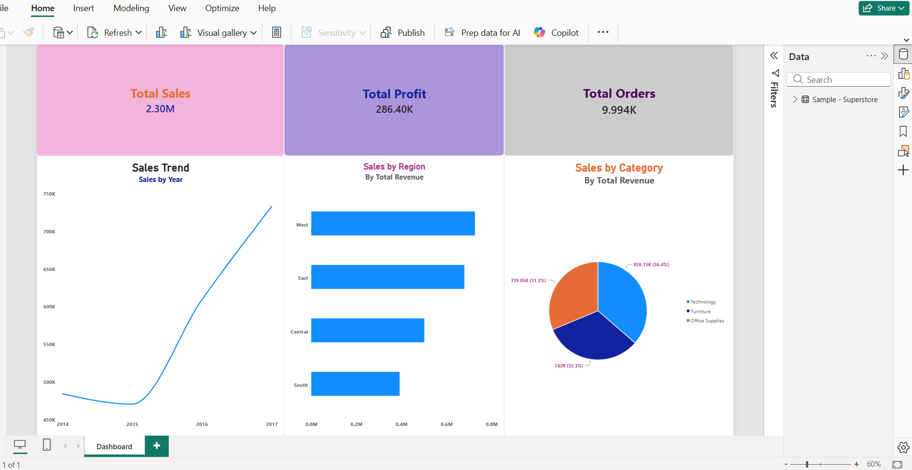

# Superstore Sales Dashboard
An interactive Power BI dashboard analyzing $2.30M in retail sales data across 9,994 orders.

## Tools Used
- Excel (Data cleaning,validation,formatting)
- Power BI (Dashboard design and visualization)

  ## Key Metrics
  - Total Sales: $2.30M
  - Total profit: $286.40k
  - Total Orders: 9,994

  ## Key Insights
    - Sales data spans 2014-2017,with sharp growth beginning around 2015 (nearly 50% increase by 2017)
    - West region leads in sales, followed by East, Central , and South-South underperforms, suggesting opportunity
      for a targeted regional campaign
    - Technology is the top revenue category (36.4%),followed by Furniture (32.3%) and Office supplies (31.3%)

 ## Dashboard Preview
 
 
